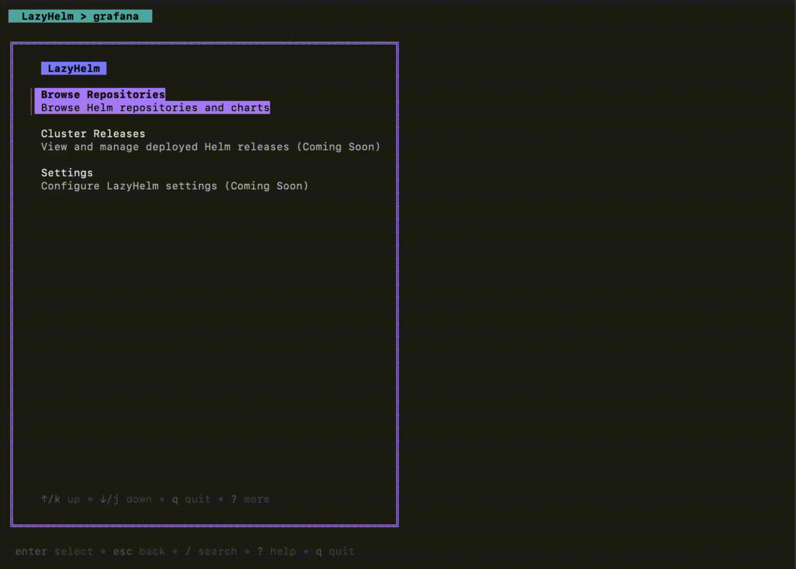

# LazyHelm

A terminal UI for browsing and managing Helm charts. Inspired by lazygit and lazydocker.

## Demo



*Demo updated to version 0.2.2*

## What it does

LazyHelm brings an intuitive, lazygit-style interface to Helm:

- **Browse & Search** - Explore Helm repos, search Artifact Hub, discover charts
- **View & Compare** - Syntax-highlighted values, diff between versions or revisions
- **Edit & Export** - Modify values in your editor, export configurations
- **Cluster Integration** - View deployed releases, explore revision history, compare any two revisions
- **Search Everything** - Fuzzy search through repos, charts, values, and releases

All in your terminal. No need to remember helm commands or manually fetch values.

## Features

### Chart Repository Management
- **Intuitive menu system** - Organized navigation for repositories, charts, and cluster resources
- **Interactive browsing** - Browse local Helm repositories and charts
- **Artifact Hub integration** - Search and browse charts directly from Artifact Hub
- **Repository operations** - Add, remove, and update repository indexes
- **Add from Artifact Hub** - Install repos with package info and security reports

### Chart Analysis
- **Syntax-highlighted YAML** - Beautiful YAML rendering with full syntax highlighting
- **Version comparison** - Diff between any two chart versions side-by-side
- **Values editing** - Edit values in your preferred editor (nvim/vim/vi) with validation
- **Export values** - Save chart values to files for backup or customization
- **Template preview** - Generate and preview Helm templates before deployment
- **YAML path copy** - Copy any YAML path to clipboard for quick reference

### Cluster Releases (Read-Only)
- **Browse releases** - View all deployed Helm releases across namespaces
- **Namespace filtering** - Filter releases by specific namespace or view all
- **Release details** - View status, chart version, app version, and deployment notes
- **Revision history** - Interactive history showing all deployments with descriptions
- **Historical values** - Inspect values from any revision (current or past)
- **Revision diff** - Compare values between any two revisions with side-by-side view
- **Export release values** - Save deployed configuration to files
- **Kubectl context** - Always shows current cluster context for safety
- **Search in values** - Fuzzy search through release configurations
- **Horizontal scroll** - Full support for long configuration lines

### Search & Navigation
- **Fuzzy search** - Fast search through repos, charts, versions, values, and releases
- **Quick filter clear** - Instantly restore full lists
- **Search in content** - Find text in YAML files with match highlighting
- **Jump to matches** - Navigate between search results with visual feedback

## Installation

### Homebrew

```bash
brew tap alessandropitocchi/lazyhelm
brew install lazyhelm
```

Or in one command:
```bash
brew install alessandropitocchi/lazyhelm/lazyhelm
```

### Install script

```bash
curl -sSL https://raw.githubusercontent.com/alessandropitocchi/lazyhelm/main/install.sh | bash
```

### From source

```bash
git clone https://github.com/alessandropitocchi/lazyhelm.git
cd lazyhelm
make install
```

## Usage

Just run:
```bash
lazyhelm
```

Set your editor if you want (defaults to nvim → vim → vi):
```bash
export EDITOR=nvim
```

### Menu Structure

LazyHelm uses an intuitive menu system to organize functionality:

```
Main Menu
├── Browse Repositories
│   ├── Local Repositories - Browse your configured Helm repos
│   └── Search Artifact Hub - Search charts on Artifact Hub
├── Cluster Releases - View and analyze deployed Helm releases
│   ├── All Namespaces - View releases across all namespaces
│   └── Select Namespace - Filter by specific namespace
└── Settings (Coming Soon) - Configure LazyHelm
```

## Keybindings

### Navigation
- `↑/k`, `↓/j` - Move up/down
- `←`, `→` - Scroll left/right (in values/detail views)
- `enter` - Select item / Go deeper
- `esc` - Go back to previous screen
- `q` - Quit application
- `?` - Toggle help screen

### Search & Filter
- `/` - Search/filter in current view
- `c` - Clear search filter
- `n` - Next search result
- `N` - Previous search result

### Repository Management
- `a` - Add new repository
- `r` - Remove selected repository
- `u` - Update repository index (helm repo update)
- `s` - Search Artifact Hub

### Chart & Version Actions
- `v` - View all versions (in chart list)
- `d` - Diff two versions (select first, then second)

### Cluster Releases
- `v` - View current release values (in release detail)
- `h` - View release history & revisions (in release detail)
- `d` - Diff two revisions (in revision history: select first, then second)
- `w` - Export release values to file (in values view)
- `/` - Search in release list or values
- `c` - Clear search filter

### Values View
- `e` - Edit values in external editor ($EDITOR)
- `w` - Write/export values to file
- `t` - Generate Helm template
- `y` - Copy YAML path to clipboard
- `←`, `→` - Scroll horizontally for long lines

## How it works

Uses the Helm SDK to interact with chart repos and the [Bubbletea](https://github.com/charmbracelet/bubbletea) framework for the TUI.

Reads from your existing Helm config (`~/.config/helm/repositories.yaml`) and caches data locally for faster browsing.

## Requirements

- Helm 3.x installed
- kubectl configured with valid context (optional, for Cluster Releases feature)
- Go 1.21+ (if building from source)
- Terminal with ANSI color support
- kubectl configured with valid context (optional, for Cluster Releases feature)

## Development

```bash
git clone https://github.com/alessandropitocchi/lazyhelm.git
cd lazyhelm
go mod download
go build -o lazyhelm ./cmd/lazyhelm
./lazyhelm
```

## TODO

- Helm operations (install/upgrade/uninstall/rollback)
- View manifest for deployed releases
- Switch kubectl context from UI
- Config file
- Bookmarks

## License

Licensed under the Apache License, Version 2.0 - see the [LICENSE](LICENSE) file for details.

Copyright 2025 Alessandro Pitocchi
